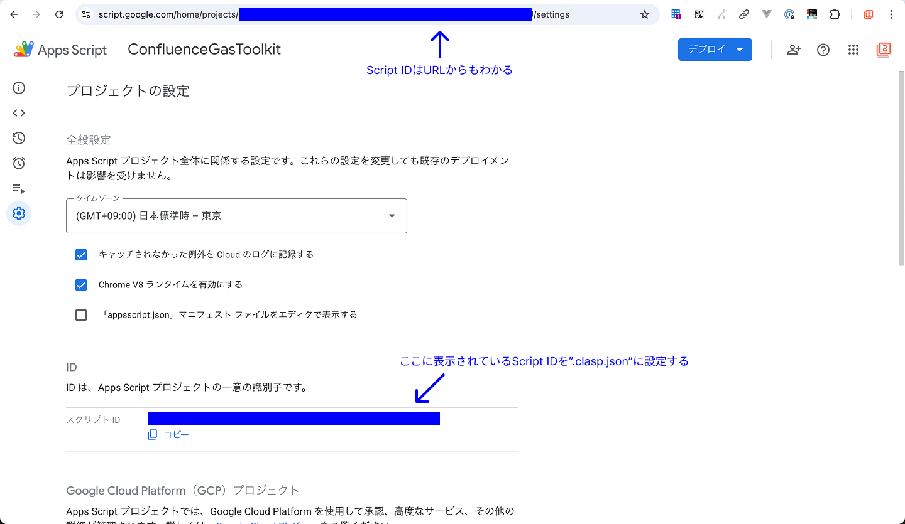
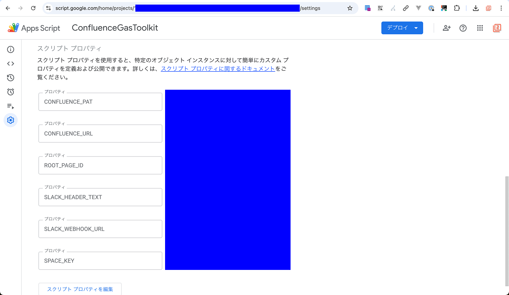

# confluence-gas-toolkit

`confluence-gas-toolkit` は、Google Apps Script（GAS）から Confluence Server / Data Center (オンプレ版) を操作するためのツールキットです。

## 🛠 主な機能

- 更新ページのSlack通知

## 💻 セットアップ方法（Getting Started）

### ローカル実行環境の構築

1. .envファイルの作成

    ```bash
    cp .env.sample .env
    ```

1. .envファイル内の各変数に値を設定（ローカル環境から実行する際に使用）

1. Bun のインストール ([URL](https://bun.sh/docs/installation))

1. パッケージのインストール

    ```bash
    bun install
    ```

1. ローカル実行コマンドの実行

    ```bash
    bun run ./debug-local.ts
    ```

### GAS環境へのアップロード

1. 設定ファイルの作成

    ```bash
    cp .clasp.json.sample .clasp.json
    ```

1. `.clasp.json` 内の `scriptId` に反映対象の Script ID を設定

    <details>
      <summary>Script ID の調べ方</summary>

      1. 反映予定のAppScriptを開く
      1. サイドバーの歯車アイコン（プロジェクトの設定）を選択
      1. 下図の位置に Script ID が表示されている

          
    </details><br>

1. GAS環境に反映

    ```bash
    bun run push        # push project to Google Apps Script using .clasp-dev.json 
    bun run push:prod   # push project to Google Apps Script using .clasp-prod.json 
    # (automatically duplicated from .clasp.json if not present)
    ```

    ### Tips

    #### コマンドからAppScriptを開く
    ```bash
    bun run open        # open project in browser
    bun run open:prod   # open project in browser(in .clasp-prod.json)
    ```
     #### アプリのデプロイ（利用しない予定）
    ```bash
    bun run deploy      # deploy project using .clasp-dev.json
    bun run deploy:prod # deploy project using .clasp-prod.json
    ```

1. Script Property の設定 (GAS環境側の環境変数)

    `.env` に設定した環境変数

    <details>
      <summary>Script Property の設定方法</summary>

      1. AppScriptを開く
      1. サイドバーの歯車アイコン（プロジェクトの設定）を選択
      1. 下図の位置に Script ID が表示されている

          
    </details>
